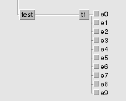

Tutorial
--------

This tutorial provides a simple introduction to Ecflowrun. It assumes the reader already
has some basic knowledge of the concepts of Ecflow. If not, please refer to the Ecflow website_
and before doing this tutorial try to understand those concepts.

.. _website: https://software.ecmwf.int/wiki/display/ECFLOW/Tutorial

Running a simple Bash script
^^^^^^^^^^^^^^^^^^^^^^^^^^^^

The main purpose of Ecflowrun is to provide an abstraction layer on top of Ecflow, allowing
users to write Python tasks while not having to think about code that is required by
Ecflow to handle task starting, aborting and completing for example.

Ecflowrun also provides generic tasks that allow users to run scripts on other languages,
like Bash. Taking on the tutorial provided at the Ecflow website, we will first create
a very simple task that runs a Bash command. But instead of writing a Bash script, we
will write a task script using Ecflowrun.

On the task script called t1.ecf we will now write the following:

.. code:: python

    from ecflowrun.tasks import BashTask

    ENV = {
        'ECF_PORT': '%ECF_PORT%',
        'ECF_NODE': '%ECF_NODE%',
        'ECF_NAME': '%ECF_NAME%',
        'ECF_PASS': '%ECF_PASS%',
        'ECF_TRYNO': '%ECF_TRYNO%',
        'LOGGER': '%ECF_NAME%'
    }

    BashTask(
        'echo "I am part of a suite that lives in %ECF_HOME%"',
        ENV
    ).execute()

First, we import the ``BashTask`` class from Ecflowrun. This class is a wrapper provided by
Ecflowrun that allows the user to run Bash scripts and commands. When using the generic
tasks provided by the package, the only initialization that needs to be provided by the user
are the variables created by the Ecflow server. This is done next when we declare the ``ENV``
variable, which is a mapping that allows us to send to the ``BashTask`` internals the value
of variables which would otherwise be inaccessible.

One very important concept is now introduced: the user can pass any variable it wants but
Ecflow requires that ``ECF_PORT``, ``ECF_NODE``, ``ECF_NAME``, ``ECF_PASS`` and ``ECF_TRYNO``
are all set, so this is the list of **mandatory** variables that must be always provided.
Otherwise the server won't be able to communicate with the running task and havoc is all
the user gets.

Finally, we create an instance of the ``BashTask``. The first argument is the Bash script
or command the user wants to run, and the second argument is the previously defined environment
mapping that holds all the values required for the task to communicate with the server. And after
this, we make an explicit call to the class ``execute`` method, asking the server to run our task.
Another way of doing this could be

.. code:: python

    task = BashTask(
        'echo "I am part of a suite that lives in %ECF_HOME%"',
        ENV
    )

    task.execute()

But we can chain the execution to the instantiating of the class and bypass the unnecessary
creation of a new variable.

Getting to know the Manager
^^^^^^^^^^^^^^^^^^^^^^^^^^^

At the heart of Ecflowrun lives the ``EcflowContextManager``, that provides the context where
our tasks are run. It acts as an advanced interface to interact with the Ecflow server, but most
of its functionalities are hidden from the user. Instead, the manager shall be used as a standard
Python context manager, this is, inside a ``with`` statement:

.. code:: python

    with EcflowContextManager() as ctx:
        pass

The context manager handles all communication with the server for the user. It tells the server
when the task starts and when the task completes, while also aborting the task if any error is
detected. Everything that is inside the ``with`` statement is considered to be the task.

Applying this to our example using the ``BashTask`` we would now have a task script like this:

.. code:: python

    from ecflowrun.context.manager import EcflowContextManager

    ENV = {
        'ECF_PORT': '%ECF_PORT%',
        'ECF_NODE': '%ECF_NODE%',
        'ECF_NAME': '%ECF_NAME%',
        'ECF_PASS': '%ECF_PASS%',
        'ECF_TRYNO': '%ECF_TRYNO%',
        'LOGGER': '%ECF_NAME%'
    }

    with EcflowContextManager(**ENV) as ctx:
        print 'I am part of a suite that lives in %ECF_HOME%'

Note that we define again the ``ENV`` mapping and we now pass the variable to the manager as
an argument. Inside the ``with`` statement we now use the ``print`` function instead of the
``echo`` facility to print our message.

Advanced usage of the Manager
^^^^^^^^^^^^^^^^^^^^^^^^^^^^^

Our previous example was very simple: we are only using the Manager to make a print to
``stdout``. But the Manager, within its capabilities for communicating with the server
allows for more advanced usage by the user.

In the next example, imagine we have a task that triggers multiple events:

The user can use the manager to trigger the events while running the tasks, using the
manager ``event`` method.

.. code:: python

    from ecflowrun.context.manager import EcflowContextManager

    ENV = {
        'ECF_PORT': '%ECF_PORT%',
        'ECF_NODE': '%ECF_NODE%',
        'ECF_NAME': '%ECF_NAME%',
        'ECF_PASS': '%ECF_PASS%',
        'ECF_TRYNO': '%ECF_TRYNO%',
        'LOGGER': '%ECF_NAME%'
    }

    with EcflowContextManager(**ENV) as ctx:
        for i in xrange(10):
            # Perform some work
            ctx.event('e{}'.format(i))
